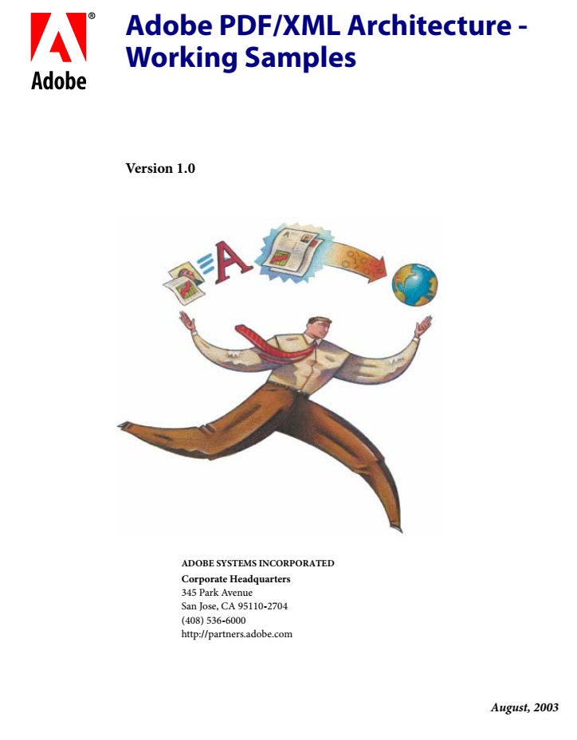
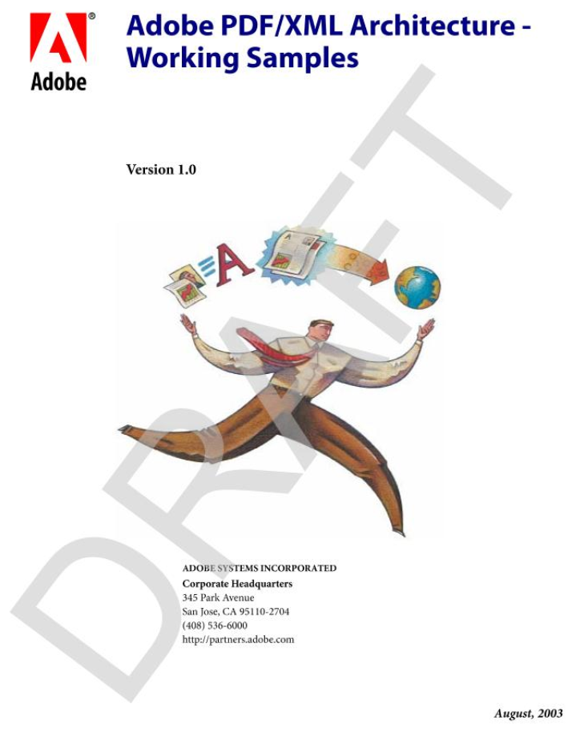
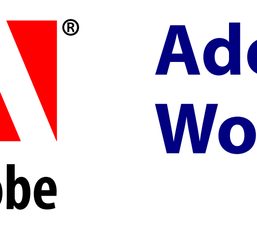

# pdf-revise
Command line tool which allows to edit pdf files. 
Originally, it was developed to create a non-editable draft copy of a pdf by adding watermark text and rendering all pages as images. It quickly has gained more functionality such as page extraction, high quality page rendering to image files and merging pdf files. It provides an easy to extend task model to edit pdfs.

The tool uses the com.itextpdf.itext and org.apache.pdfbox libraries.

## Usage
Call with: `java -jar pdf-revise.jar [input pdf file] [options] [task1] [task1 options] [task2] [task2 options] ... `
```  
  Options: defined as --option_name=value
  Tasks are executed in the order they appear n the command line
    -o, --out
      Name of the output file.
      Default: [input pdf file].out.pdf
    --help, -?, --?, /?
      Show this help screen
  Tasks:
    add-image-watermark      Add a watermark over every image
      Usage: add-image-watermark [watermark text]

    append      Appends the specified pdf file
      Usage: append [file to append]

    disable-copy-paste      Disables the Copy/Paste function in pdf readers
      Usage: disable-copy-paste

    add-page-numbers      Adds page numbers
      Usage: add-page-numbers [options]
        Options:
          --font
            The font to use
            Default: Helvetica
          --font-color
            The font color to use
            Default: java.awt.Color[r=0,g=0,b=0]
          --font-size
            The font size to use
            Default: 10
          -h, --horizontal
            Horizontal alignment on the page
            Default: center
            Possible Values: [near, center, far]
          --horizontal-margin
            Horizontal margin
            Default: 20.0
          --start-at
            Numbering starts with this number
            Default: 1
          --style
            The style of the page numbers
            Default: arabic
            Possible Values: [arabic, roman]
          -v, --vertical
            Vertical alignment on the page
            Default: far
            Possible Values: [near, center, far]
          --vertical-margin
            Vertical margin
            Default: 20.0

    render-pages      Replace page contents by a rendered image of the page
      Usage: render-pages [options]
        Options:
          --dpi
            The DPI to render the pdf pages with
            Default: 150

    replace-text      Replaces text in a pdf (experimental!)
      Usage: replace-text [options] [text to be replaced]
        Options:
          --with
            The text to insert
            Default: <empty string>

    add-page-watermark      Add a watermark to every page
      Usage: add-page-watermark [options] [watermark text]
        Options:
          --layer
            Where to put the watermark text
            Default: background
            Possible Values: [foreground, fg, background, bg]

    render-to-folder      Render pages as images to the given folder (in png 
            format) 
      Usage: render-to-folder [options] [target folder]
        Options:
          --dpi
            The DPI to render the pdf pages with
            Default: 150

    extract      Extract only the filtered pages from the pdf and copy them to 
            the target
      Usage: extract

    pages      Specifies the pages to which subsequent tasks should be 
            applied. 
      Usage: pages [page sequence (e.g. 1,2-5,!3,6-10)]
```

## Example

Sample output for a pdf for options `add-page-watermark --layer=foreground render-pages --dpi=90`:

PDF page, before (left) and after (right) processing:<br>
 
<br><br>
Zoomed at 400%, before (left) and after (right) processing:<br>
 

## Compiling

The project uses maven, so compiling and creating an executable jar is easy.
Calling `mvn package` will package the tool and all dependencies in a single jar which can be executed.

